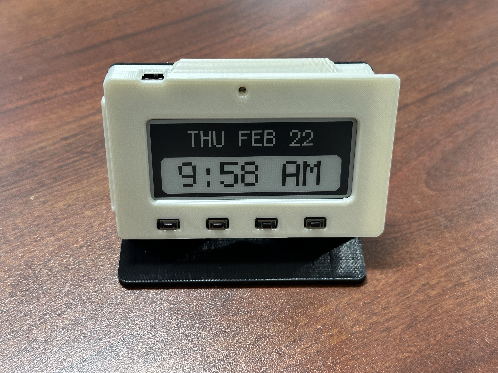

# MagTag Clock
### Create a simple e-paper clock using the [Adafruit MagTag](https://www.adafruit.com/magtag)

## Overview
Using the APIs from [Adafruit IO](https://io.adafruit.com/), this script will connect over WiFi to fetch the date and time upon startup and refresh each minute. You will need to make a free account at [Adafruit IO](https://io.adafruit.com/).

*Want the 3D printed stand? You can find it [here](https://learn.adafruit.com/magtag-3d-printed-stand-case/overview)!*

## Efficiency
Originally, my script fetched the time every 60 seconds. However this posed two problems:
1. Each time the device connects to WiFi, there's a chance that it will time out.
2. WiFi uses more battery!
3. I generally find the Internet of Things annoying.

To solve this, the script only fetches the date and time upon startup and at the top of every hour (I found the RTC to slowly drift over time otherwise). After updating the display, the script will calculate the duration until the next minute change and enter deep sleep for that amount of time.

## Setup
1. Follow the guide at [AdaFruit](https://learn.adafruit.com/adafruit-magtag/circuitpython) to install CircuitPython. Please use 8.x. I cannot guarantee that the code will work on the 9.x beta.
2. Make an account at [Adafruit IO](https://io.adafruit.com/) and get your username and API key.
3. Using a text editor of your choice, edit [secrets_template.py](/src/secrets_template.py) with your WiFi information and AIO username and API key.
    * **Note:** Unsecured networks get `'password' : '',`
4. Once you mount your MagTag, copy everything in the `src` folder to the root of `CIRCUITPY`:
    * `code.py`
    * `secrets.py`
    * `lib` (the entire folder)
5. Safely eject your device (especially important on MacOS) and enjoy!

## Credits
Code for fetching the time adapted from [Collin Cunningham](https://learn.adafruit.com/magtag-cat-feeder-clock/getting-the-date-time).
